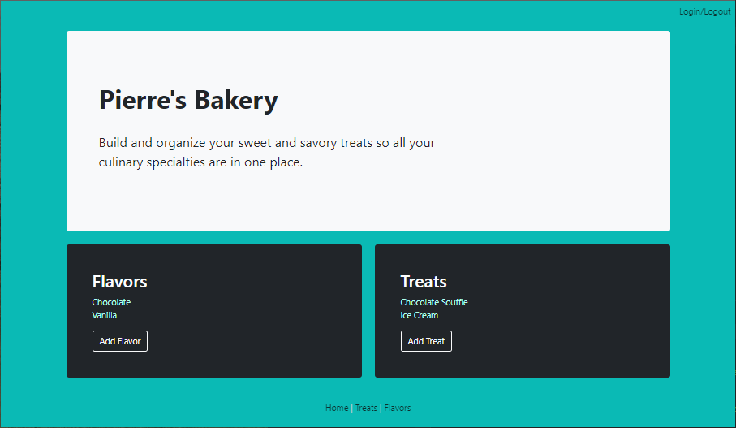

<p align="center">
  <u><big>|| <b>Pierre's Bakery</b> ||</big></u>
  <br>
  <em>Epicodus - C# - C# Authentication with Identity -  Code Review</em>
  <br>
  <br>
  <strong>Jessi B</strong>
  <br>
  <small>March 2022</small>
  <br>
  ___________________________
  <br>

  

------------------------------

### <u>Table of Contents</u>
* <a href="#-description">Description</a>
* <a href="#-technologies-used">Technologies Used</a>
* <a href="#-setup-&-installation">Setup & Installation</a>
* <a href="#-known-bugs">Known Bugs</a>
* <a href="#-contact">Contact</a>
* <a href="#-license">License</a>

------------------------------

### Description
This C# web app uses user authentication and a many-to-many relationship where a treat can have many flavors (such as sweet, savory, spicy, or creamy) and a flavor can have many treats. While all users have read functionality, a logged in users can create, update and delete sweets & treats. The splash page lists all treats and flavors. Users are able to click on an individual treat or flavor to see all the treats/flavors that belong to it.

<!-- <em>User Stories</em><br>
As a user, I want to .... -->
#
### Technologies Used
* [Visual Studio Code](https://code.visualstudio.com/)
* [.NET](https://dotnet.microsoft.com/en-us/download)
* [MYSQL](https://dev.mysql.com/downloads/)
* [C#](https://docs.microsoft.com/en-us/dotnet/csharp/)
* Entity Framework
* ASP.NET Core MVC
* [LINQ](https://docs.microsoft.com/en-us/dotnet/csharp/programming-guide/concepts/linq/)
* [HTML](https://developer.mozilla.org/en-US/docs/Web/HTML)
* [CSS](https://developer.mozilla.org/en-US/docs/Web/CSS)
#
### Setup & Installation
* Clone Repo: In your terminal, navigate to your desktop or other desired location and enter `git clone https://github.com/jessi-b/Pierre-sSweet-SavoryTreats.git`
* Add Required Packages: Navigate to the top level of the project directory called _Pierre_ & enter `dotnet build`
* Protect Your MySQL Password: Enter touch .gitignore & touch appsettings.json in the command line
* Add the following code to appsettings.json & fill in your password where designated:
```
{ 
  "ConnectionStrings": { 
    "DefaultConnection": "Server=localhost;Port=3306;database=jessi_baker_pierre;uid=root;pwd=YOUR-PASSWORD-HERE;" 
  } 
}
```
* Update Database: Enter `dotnet ef migrations add Initial` then `dotnet ef database update` in the terminal
* Try Out This Web App: Enter `dotnet run` in the command line and navigte to _http://localhost:5000/_ in your browser.  *This is not yet published*
#
### Known Bugs
No known bugs.
#
### License
Copyright (c)  _Mar 2022_  _Jessi B_
#
### Contact
_If you run into any issues or have questions, ideas or concerns or wish to make a contribution to the code see contact information below._
* Jessi B  <em><jessb.dev@gmail.com></em>
------------------------------
<p align="center"><a href="#">Return to Top</a></p>